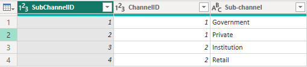
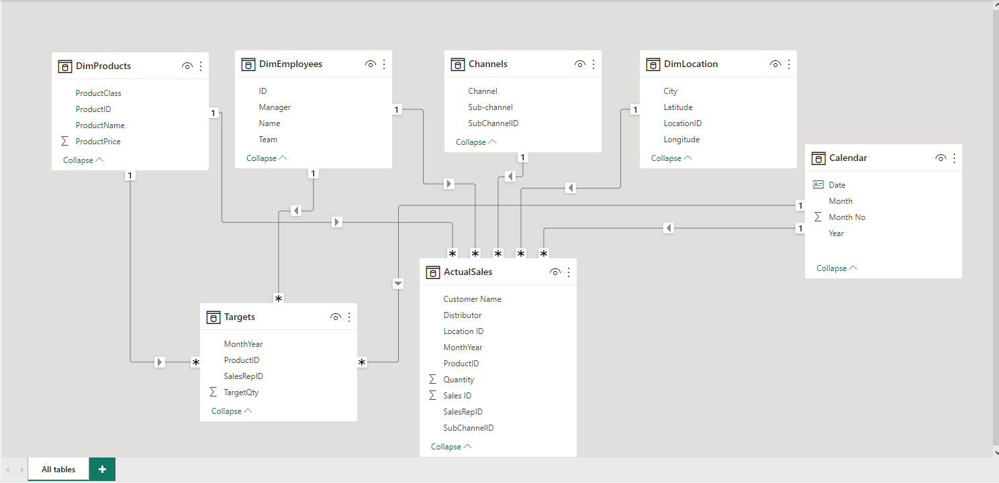

# Forggith Pharmaceutical Analysis

---

## Background/Introduction
This is a breakdown of **Forggith Pharmaceuticals** sales and marketing report process. 
**Forggith Pharmaceuticals** is a Pharmaceutical Manufacturing company based in Germany. 
The dataset was provided by **Ahmed Oyelowo** as a **_one-month internship program_**, the project is to analyze and derive insights from dataset provided, so as to make crucial and data driven decisions. The tool used for the report was **_Microsoft Power BI_**. 

## Data Description
The dataset provided includes a **pharmTargets** (which is a file showing the targets quantity each sales rep must achieve between the year 2022 to 2025), a **pharmDataset** (which shows a range of information about the sales, ranging from the location, to the product, channel, employees etc.) and a file showing the image of the company's **Logo**.

## Objective
The objective of this project is to create some Power BI Reports to assist in guiding Forggith Pharmaceuticals company’s **_strategies_**, **_tactics_** and **_operations_** as a company. 

## Data Dictionary
I created a **_data dictionary_** from the datasets provided, this is to describe my understanding of the dataset. A **_data dictionary_** is a collection of names, definitions, and attributes about data elements that are being used or captured in a database, information system, or part of a research project.	 							
## Forggith Dataset Dictionary																
1.	**_LocationID_** -	Unique identifier for each location							
2.	**_City_** - City where the customer is located							
3.	**_Latitude_** - Latitude of each location							
4.	**_Longitude_**	- Longitude of each location							
5.	**_SubChannelID_**	- Unique identifier for each SubChannel   				
6.	**_ChannelID_** -	Unique identifier for each Channel							
7.	**_Sub-channel_** -	A division of the channel where the product can be gotten							
8.	**_Channel_**	- Where the product can be gotten							
9.	**_ProductID_**	-Unique identifier for each products							
10.	**_ProductName_** -	Name of each products							
11.	**_ProductClass_**	- Class/category each product belongs to							
12.	**_ProductPrice_** -	Price of each products							
13.	**_ID_** -	Unique identifier of each employee							
14.	**_Name_**	- Name of each employee							
15.	**_Manager_** -	Manager of each employee							
16.	**_Team_**	- Team each employee belongs to							
17.	**_Sales ID_** -	Unique identifier of each sales made							
18.	**_MonthYear_** -	Date each sales was made							
19.	**_SalesRepID_**	- Unique identifier of each sales rep							
20.	**_Distributor_**	- Distributor of each product							
21.	**_Customer Name_**	- Name of customers that made sales							
22.	**_Quantity_** -	Amount of products sold

## Data Transformation
I used the **_Microsoft Power Bi_** tool for this project, the **pharmDataset** and **pharmTargets** dataset was loaded into the **_power query_** and the following transformation were performed;

- ### Sales 2022 & Sales 2023-2025
Using the **_Append function_**, The Sales 2022 and Sales2023-2025 table was concatenate into a single table, named **_Actual Sales_**. This is to make sure all the rows in both tables are combined into a single table since they contain the same numbers of rows and columns.

---

- ### Target
In the target table, I unpivot the **_2022, 2023, 2024 and 2025_** table so as to have year on a single column and the target quantities in different columns. After having the years on a single column, I merged the Year and Month column to a single column, then named it **MonthYear**.

Target Before                       |              Target After
:----------------------------------:|:-------------------------------------------------:
             |             
---

- ### DimChannel and DimSubChannel
Using the **_Merge function_**, I merged both tables using the **_ChannelID_** common among them,then named the new column **_Channel_**.

DimChannel                          |               DimSubChannel                       |              Channel
:----------------------------------:|:-------------------------------------------------:|:------------------------------------------------:
                 |                             |                    
---

### Calendar Table
I created a Calendar Table that contains **_Date, Year, Month, Month No and Quarter_** using the **Dax Measures** below;

         Calendar = 

          ADDCOLUMNS (CALENDARAUTO(),

          "Year", YEAR([Date]),
          
          "Month", FORMAT([Date],"mmm"),
          
          "Month No", MONTH([Date]),
          
          "Quarter", FORMAT([Date], "\QQ")
          
          )

## Dax Measures

I created the following **Dax Measure** throughout my analysis;

     Target Revenue =

     SUMX(Targets, Targets[TargetQty] * RELATED(DimProducts[ProductPrice])
     
     )
   
     TargetRev YTD	=
    
     CALCULATE(Targets[Target Revenue],
     
              DATESYTD('Calendar'[Date] )
              
              )
     
     Volume Target	=
     
     SUM(Targets[TargetQty])
     
     Actual Revenue	= 
     
     SUMX(ActualSales, ActualSales[Quantity] * RELATED(DimProducts[ProductPrice])
     
     )
     
     TotalRev YTD	= 
     
     CALCULATE([Actual Revenue],
     
              DATESYTD('Calendar'[Date])
              
              )
              
     TotalRev PY YTD	= 
     
     CALCULATE(ActualSales[Actual Revenue],

              PREVIOUSYEAR(DATESYTD('Calendar'[Date]))

     )
     
     TotalRev SPLY	=
     
     CALCULATE([Actual Revenue],
               
               SAMEPERIODLASTYEAR('Calendar'[Date])
               
               )
               
     Total Targ YTD	=
     
     CALCULATE(Targets[Target Revenue],
     
                 DATESYTD('Calendar'[Date])
                 
                 )
     TargetRev PY YTD	=
     
     CALCULATE(Targets[Target Revenue],
     
                  PREVIOUSYEAR(DATESYTD('Calendar'[Date]))
                  
                  )
                  
     PM Revenue	=
     
     CALCULATE(ActualSales[Actual Revenue], 
     
               PREVIOUSMONTH('Calendar'[Date])
              
               )
               
     MoM	VAR CurrentValue = ActualSales[Actual Revenue]
     
     VAR PreviousValue = [PM Revenue]
     
     VAR Result =
     
     IF(
     
     not ISBLANK(CurrentValue) && not ISBLANK(PreviousValue),
     
     CurrentValue - PreviousValue
     
     )
     
     RETURN 
     
     Result
     
     MoM %	= 
     
     DIVIDE([MoM], [PM Revenue], 0)
     
     Volume Achieved	= SUM(ActualSales[Quantity])
     
     Target Revenue %	= 
     
     DIVIDE(Targets[Target Revenue], ActualSales[Actual Revenue],0)
     
     Total Transactions = COUNT(ActualSales[Quantity])

## Data Modelling
Automatically derived relationships are adjusted so as to remove/replaced unwanted relationship with the required one. The **data model** is a **_star schema_**, it contains two **_Fact tables_** (Actual Sales and Targets), four **_Dimension tables_** (DimProduct, DimEmployees, DimLocation, and Channels) and one **_Calendar table_**.

---

## Data Analysis and Visualization
The report consist of two pages

- ###  Sales Performance Overview

---

The following were observed from the sales dashboard above

- The month with the highest MOM % Change in sales is **_February_**.
- **Butzbach** generated the highest revenue by **_location_** across all the year.
- **52.9%** of the sales are made through the **_Pharmacy Channel_**.
- The class of **_product_** with the highest sales is the **_Analgesics_**.
- The annual revenue generated across all years is **_$11.12bn_** which exceeded the targeted revenue by **_$2.67bn_**. This means Forggith pharmaceuticals realize a profit of _**$2.67bn_** in four years.
  
-  ### Marketing Performance Overview
 
---

The following insights were deduced from the marketing dashboard above
- **Delta Team** is the most productive sales team.
- **Abigail Thompson** generated the highest revenue among the sales representative.
- Across all metrics, **_Year 2025_** achieved the lowest volume to target ratio, while **_Year 2022_** achieved the highest volume to target ratio.
- The product with the highest revenue is **_Ionclotide_** with a revenue of **$165,614,153**.

You can interact with the report [here](https://app.powerbi.com/reportEmbed?reportId=dccf33bc-185b-43e2-923e-0510907228f9&autoAuth=true&ctid=392f0553-2f21-474a-b57c-b2d2960cfe79)

## Conclusion & Recommendations
- **Abigail Thompson** generated the highest revenue overall throughout the years, however, some employees like **_Stella Given, Jimmy Grey and Anne Wu_** made the highest revenue in the Year **_2025, 2024 and 2022_** respectively.
- There was an **_annual increase_** in the revenue generated except in the **_Year 2025_**, which recorded a **$271,265,688** decrease compare to the previous year.
- **Team Delta** should be rewarded for their great work as they recorded the **_highest revenue_** across all years.
- Different cities made it to the location with the highest revenue generated each year. However, **Forggith pharmaceuticals** should make findings as to why **_Butzbach_** generated a tremendous highest revenue in the **_year 2024_**, and they didn’t make it to the **_top 10_** in the following year. 

---
Thanks for reading. 

 

									

